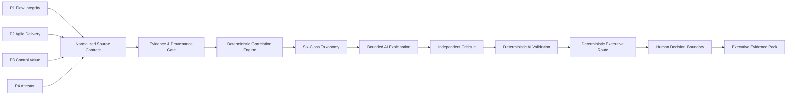

# VANTIX Synthesis

**Cross-project governed intelligence for evidence-backed executive correlation.**

> **Portfolio Preview v0.1 — synthetic integration layer.** VANTIX Synthesis correlates normalized outputs from Projects 1–4 without changing the source projects’ authoritative facts, severity, approval state, closure state, or Six Sigma denominator.

[Executive Brief](docs/EXECUTIVE_BRIEF.md) · [Architecture](docs/ARCHITECTURE.md) · [Correlate Without Compressing](docs/CORRELATE_WITHOUT_COMPRESSING.md) · [Evidence Index](docs/EVIDENCE_INDEX.md) · [Quality Scorecard](docs/QUALITY_SCORECARD.md)

## The business problem

Enterprise operating risk rarely appears inside one workflow.

A governance defect may look minor in isolation. A delivery-readiness issue may look operational. An unresolved customer commitment may look like a Customer Success problem. A deteriorating customer-momentum signal may look commercial.

The executive problem is understanding when those signals are:
- duplicates;
- repeated;
- related;
- compounding;
- contradictory;
- still unresolved.

Synthesis provides that correlation layer while preserving source authority.

## Architecture

## Canonical correlation taxonomy

1. `duplicate`
2. `repeated`
3. `related`
4. `compounding`
5. `contradictory`
6. `unresolved`

The engine does **not** create a universal enterprise risk score.

## Source authority

| Source | What remains authoritative there |
|---|---|
| Project 1 — Flow Integrity | governance facts, deterministic defect measurement, source severity/routing |
| Project 2 — Agile Delivery | intake/readiness/duplicate/risk/workload and approval state |
| Project 3 — Control Value | commitment evidence, permitted-action policy, outcome verification and closure |
| Project 4 — Attestor | module-specific commitment, service-recovery and customer-momentum evidence/routes |

Synthesis may explain relationships between those facts. It may not rewrite them.

## Current executable evidence

- **Main exact-node chain:** locally executable directly from the shipped n8n Code-node JavaScript.
- **Six taxonomy classes:** all six generated in the synthetic reference fixture.
- **Adversarial suite:** **24/24 PASS** in offline exact-node execution.
- **Package negative tests:** deliberately attack links, secrets, scores, hashes, graph rules and source-authority controls.
- **Human identity boundary:** explicitly labelled synthetic; not authenticated production identity.
- **Six Sigma boundary:** Synthesis measures correlation-quality defects only; it never pools domain DPMO denominators.

See [Evidence Provenance](docs/EVIDENCE_PROVENANCE.md).

## What this does not prove

- live cross-repository API integration;
- live Salesforce or CRM ingestion;
- live model-provider execution;
- authenticated enterprise human approval;
- production-scale correlation accuracy;
- real-customer business impact;
- statistically stable process capability;
- external certification;
- production readiness.

## Source repositories

The public repository URLs are recorded in [`source-manifest.json`](source-manifest.json).

The source manifest is bound to the frozen Project 1–4 commits: P1 `dd75ea5`, P2 `a4137f8`, P3 `6e605dd`, and P4 `8fdf848`. These bindings are reference data and do not change Synthesis architecture.

## Reviewer path

- [Plain-Language Summary](docs/PLAIN_LANGUAGE_SUMMARY.md)
- [Executive Brief](docs/EXECUTIVE_BRIEF.md)
- [Architecture](docs/ARCHITECTURE.md)
- [Correlation Taxonomy](docs/CORRELATION_TAXONOMY.md)
- [Correlate Without Compressing](docs/CORRELATE_WITHOUT_COMPRESSING.md)
- [Evidence Model](docs/EVIDENCE_MODEL.md)
- [Decision Rights](docs/DECISION_RIGHTS.md)
- [Security / OWASP Mapping](docs/OWASP_AI_SECURITY_MAPPING.md)
- [PMP / PMI AI Governance](docs/PMP_AI_GOVERNANCE_MAPPING.md)
- [Agile Traceability](docs/AGILE_TRACEABILITY.md)
- [Six Sigma Measurement](docs/SIX_SIGMA_MEASUREMENT.md)
- [Test Catalogue](docs/TEST_CATALOGUE.md)
- [Evidence Index](docs/EVIDENCE_INDEX.md)
- [Quality Scorecard](docs/QUALITY_SCORECARD.md)

## Release position

**Portfolio Preview v0.1.**

This project is deliberately designed so the final GitHub URLs/commit SHAs of Projects 1–4 are reference data, not architectural dependencies.
